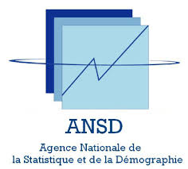

``````{=openxml}

<w:tbl xmlns:w="http://schemas.openxmlformats.org/wordprocessingml/2006/main" xmlns:r="http://schemas.openxmlformats.org/officeDocument/2006/relationships" xmlns:w14="http://schemas.microsoft.com/office/word/2010/wordml" xmlns:wp="http://schemas.openxmlformats.org/drawingml/2006/wordprocessingDrawing" xmlns:a="http://schemas.openxmlformats.org/drawingml/2006/main" xmlns:pic="http://schemas.openxmlformats.org/drawingml/2006/picture"><w:tblPr><w:tblLayout w:type="autofit"/><w:jc w:val="center"/><w:tblW w:type="pct" w:w="5000"/><w:tblLook w:firstRow="1" w:lastRow="0" w:firstColumn="0" w:lastColumn="0" w:noHBand="0" w:noVBand="1"/></w:tblPr><w:tr><w:trPr><w:trHeight w:val="360" w:hRule="auto"/></w:trPr>body1<w:tc><w:tcPr><w:tcBorders><w:bottom w:val="none" w:sz="0" w:space="0" w:color="000000"/><w:top w:val="none" w:sz="0" w:space="0" w:color="000000"/><w:left w:val="none" w:sz="0" w:space="0" w:color="000000"/><w:right w:val="none" w:sz="0" w:space="0" w:color="000000"/></w:tcBorders><w:shd w:val="clear" w:color="auto" w:fill="FFFFFF"/><w:tcMar><w:top w:w="0" w:type="dxa"/><w:bottom w:w="0" w:type="dxa"/><w:left w:w="0" w:type="dxa"/><w:right w:w="0" w:type="dxa"/></w:tcMar><w:vAlign w:val="center"/></w:tcPr><w:p><w:pPr><w:pStyle w:val="Normal"/><w:jc w:val="center"/><w:pBdr><w:bottom w:val="none" w:sz="0" w:space="0" w:color="000000"/><w:top w:val="none" w:sz="0" w:space="0" w:color="000000"/><w:left w:val="none" w:sz="0" w:space="0" w:color="000000"/><w:right w:val="none" w:sz="0" w:space="0" w:color="000000"/></w:pBdr><w:spacing w:after="100" w:before="100" w:line="240"/><w:ind w:left="100" w:right="100" w:firstLine="0" w:firstLineChars="0"/><w:rPr><w:rFonts w:ascii="Times New Roman" w:hAnsi="Times New Roman" w:eastAsia="Times New Roman" w:cs="Times New Roman"/><w:i w:val="false"/><w:b w:val="true"/><w:u w:val="none"/><w:sz w:val="28"/><w:szCs w:val="28"/><w:color w:val="000000"/></w:rPr></w:pPr><w:r xmlns:w="http://schemas.openxmlformats.org/wordprocessingml/2006/main" xmlns:wp="http://schemas.openxmlformats.org/drawingml/2006/wordprocessingDrawing" xmlns:r="http://schemas.openxmlformats.org/officeDocument/2006/relationships" xmlns:w14="http://schemas.microsoft.com/office/word/2010/wordml"><w:rPr><w:rFonts w:ascii="Times New Roman" w:hAnsi="Times New Roman" w:eastAsia="Times New Roman" w:cs="Times New Roman"/><w:i w:val="false"/><w:b w:val="true"/><w:u w:val="none"/><w:sz w:val="28"/><w:szCs w:val="28"/><w:color w:val="000000"/></w:rPr><w:t xml:space="preserve">REPUBLIQUE DU SENEGAL</w:t></w:r></w:p></w:tc></w:tr></w:tbl>
``````

|                                                     |
|:---------------------------------------------------:|
| {width="3cm" height="3cm"} |


``````{=openxml}

<w:tbl xmlns:w="http://schemas.openxmlformats.org/wordprocessingml/2006/main" xmlns:r="http://schemas.openxmlformats.org/officeDocument/2006/relationships" xmlns:w14="http://schemas.microsoft.com/office/word/2010/wordml" xmlns:wp="http://schemas.openxmlformats.org/drawingml/2006/wordprocessingDrawing" xmlns:a="http://schemas.openxmlformats.org/drawingml/2006/main" xmlns:pic="http://schemas.openxmlformats.org/drawingml/2006/picture"><w:tblPr><w:tblLayout w:type="autofit"/><w:jc w:val="center"/><w:tblW w:type="pct" w:w="5000"/><w:tblLook w:firstRow="1" w:lastRow="0" w:firstColumn="0" w:lastColumn="0" w:noHBand="0" w:noVBand="1"/></w:tblPr><w:tr><w:trPr><w:trHeight w:val="360" w:hRule="auto"/></w:trPr>body1<w:tc><w:tcPr><w:tcBorders><w:bottom w:val="none" w:sz="0" w:space="0" w:color="000000"/><w:top w:val="none" w:sz="0" w:space="0" w:color="000000"/><w:left w:val="none" w:sz="0" w:space="0" w:color="000000"/><w:right w:val="none" w:sz="0" w:space="0" w:color="000000"/></w:tcBorders><w:shd w:val="clear" w:color="auto" w:fill="FFFFFF"/><w:tcMar><w:top w:w="0" w:type="dxa"/><w:bottom w:w="0" w:type="dxa"/><w:left w:w="0" w:type="dxa"/><w:right w:w="0" w:type="dxa"/></w:tcMar><w:vAlign w:val="center"/></w:tcPr><w:p><w:pPr><w:pStyle w:val="Normal"/><w:jc w:val="center"/><w:pBdr><w:bottom w:val="none" w:sz="0" w:space="0" w:color="000000"/><w:top w:val="none" w:sz="0" w:space="0" w:color="000000"/><w:left w:val="none" w:sz="0" w:space="0" w:color="000000"/><w:right w:val="none" w:sz="0" w:space="0" w:color="000000"/></w:pBdr><w:spacing w:after="100" w:before="100" w:line="240"/><w:ind w:left="100" w:right="100" w:firstLine="0" w:firstLineChars="0"/><w:rPr><w:rFonts w:ascii="Times New Roman" w:hAnsi="Times New Roman" w:eastAsia="Times New Roman" w:cs="Times New Roman"/><w:i w:val="false"/><w:b w:val="true"/><w:u w:val="none"/><w:sz w:val="28"/><w:szCs w:val="28"/><w:color w:val="000000"/></w:rPr></w:pPr><w:r xmlns:w="http://schemas.openxmlformats.org/wordprocessingml/2006/main" xmlns:wp="http://schemas.openxmlformats.org/drawingml/2006/wordprocessingDrawing" xmlns:r="http://schemas.openxmlformats.org/officeDocument/2006/relationships" xmlns:w14="http://schemas.microsoft.com/office/word/2010/wordml"><w:rPr><w:rFonts w:ascii="Times New Roman" w:hAnsi="Times New Roman" w:eastAsia="Times New Roman" w:cs="Times New Roman"/><w:i w:val="false"/><w:b w:val="true"/><w:u w:val="none"/><w:sz w:val="28"/><w:szCs w:val="28"/><w:color w:val="000000"/></w:rPr><w:t xml:space="preserve">**********</w:t></w:r></w:p></w:tc></w:tr><w:tr><w:trPr><w:trHeight w:val="360" w:hRule="auto"/></w:trPr>body2<w:tc><w:tcPr><w:tcBorders><w:bottom w:val="none" w:sz="0" w:space="0" w:color="000000"/><w:top w:val="none" w:sz="0" w:space="0" w:color="000000"/><w:left w:val="none" w:sz="0" w:space="0" w:color="000000"/><w:right w:val="none" w:sz="0" w:space="0" w:color="000000"/></w:tcBorders><w:shd w:val="clear" w:color="auto" w:fill="FFFFFF"/><w:tcMar><w:top w:w="0" w:type="dxa"/><w:bottom w:w="0" w:type="dxa"/><w:left w:w="0" w:type="dxa"/><w:right w:w="0" w:type="dxa"/></w:tcMar><w:vAlign w:val="center"/></w:tcPr><w:p><w:pPr><w:pStyle w:val="Normal"/><w:jc w:val="center"/><w:pBdr><w:bottom w:val="none" w:sz="0" w:space="0" w:color="000000"/><w:top w:val="none" w:sz="0" w:space="0" w:color="000000"/><w:left w:val="none" w:sz="0" w:space="0" w:color="000000"/><w:right w:val="none" w:sz="0" w:space="0" w:color="000000"/></w:pBdr><w:spacing w:after="100" w:before="100" w:line="240"/><w:ind w:left="100" w:right="100" w:firstLine="0" w:firstLineChars="0"/><w:rPr><w:rFonts w:ascii="Times New Roman" w:hAnsi="Times New Roman" w:eastAsia="Times New Roman" w:cs="Times New Roman"/><w:i w:val="true"/><w:b w:val="true"/><w:u w:val="none"/><w:sz w:val="28"/><w:szCs w:val="28"/><w:color w:val="000000"/></w:rPr></w:pPr><w:r xmlns:w="http://schemas.openxmlformats.org/wordprocessingml/2006/main" xmlns:wp="http://schemas.openxmlformats.org/drawingml/2006/wordprocessingDrawing" xmlns:r="http://schemas.openxmlformats.org/officeDocument/2006/relationships" xmlns:w14="http://schemas.microsoft.com/office/word/2010/wordml"><w:rPr><w:rFonts w:ascii="Times New Roman" w:hAnsi="Times New Roman" w:eastAsia="Times New Roman" w:cs="Times New Roman"/><w:i w:val="true"/><w:b w:val="true"/><w:u w:val="none"/><w:sz w:val="28"/><w:szCs w:val="28"/><w:color w:val="000000"/></w:rPr><w:t xml:space="preserve">Un Peuple - Un But - Une Foi</w:t></w:r></w:p></w:tc></w:tr><w:tr><w:trPr><w:trHeight w:val="360" w:hRule="auto"/></w:trPr>body3<w:tc><w:tcPr><w:tcBorders><w:bottom w:val="none" w:sz="0" w:space="0" w:color="000000"/><w:top w:val="none" w:sz="0" w:space="0" w:color="000000"/><w:left w:val="none" w:sz="0" w:space="0" w:color="000000"/><w:right w:val="none" w:sz="0" w:space="0" w:color="000000"/></w:tcBorders><w:shd w:val="clear" w:color="auto" w:fill="FFFFFF"/><w:tcMar><w:top w:w="0" w:type="dxa"/><w:bottom w:w="0" w:type="dxa"/><w:left w:w="0" w:type="dxa"/><w:right w:w="0" w:type="dxa"/></w:tcMar><w:vAlign w:val="center"/></w:tcPr><w:p><w:pPr><w:pStyle w:val="Normal"/><w:jc w:val="center"/><w:pBdr><w:bottom w:val="none" w:sz="0" w:space="0" w:color="000000"/><w:top w:val="none" w:sz="0" w:space="0" w:color="000000"/><w:left w:val="none" w:sz="0" w:space="0" w:color="000000"/><w:right w:val="none" w:sz="0" w:space="0" w:color="000000"/></w:pBdr><w:spacing w:after="100" w:before="100" w:line="240"/><w:ind w:left="100" w:right="100" w:firstLine="0" w:firstLineChars="0"/><w:rPr><w:rFonts w:ascii="Times New Roman" w:hAnsi="Times New Roman" w:eastAsia="Times New Roman" w:cs="Times New Roman"/><w:i w:val="false"/><w:b w:val="true"/><w:u w:val="none"/><w:sz w:val="28"/><w:szCs w:val="28"/><w:color w:val="000000"/></w:rPr></w:pPr><w:r xmlns:w="http://schemas.openxmlformats.org/wordprocessingml/2006/main" xmlns:wp="http://schemas.openxmlformats.org/drawingml/2006/wordprocessingDrawing" xmlns:r="http://schemas.openxmlformats.org/officeDocument/2006/relationships" xmlns:w14="http://schemas.microsoft.com/office/word/2010/wordml"><w:rPr><w:rFonts w:ascii="Times New Roman" w:hAnsi="Times New Roman" w:eastAsia="Times New Roman" w:cs="Times New Roman"/><w:i w:val="false"/><w:b w:val="true"/><w:u w:val="none"/><w:sz w:val="28"/><w:szCs w:val="28"/><w:color w:val="000000"/></w:rPr><w:t xml:space="preserve">**********</w:t></w:r></w:p></w:tc></w:tr><w:tr><w:trPr><w:trHeight w:val="360" w:hRule="auto"/></w:trPr>body4<w:tc><w:tcPr><w:tcBorders><w:bottom w:val="none" w:sz="0" w:space="0" w:color="000000"/><w:top w:val="none" w:sz="0" w:space="0" w:color="000000"/><w:left w:val="none" w:sz="0" w:space="0" w:color="000000"/><w:right w:val="none" w:sz="0" w:space="0" w:color="000000"/></w:tcBorders><w:shd w:val="clear" w:color="auto" w:fill="FFFFFF"/><w:tcMar><w:top w:w="0" w:type="dxa"/><w:bottom w:w="0" w:type="dxa"/><w:left w:w="0" w:type="dxa"/><w:right w:w="0" w:type="dxa"/></w:tcMar><w:vAlign w:val="center"/></w:tcPr><w:p><w:pPr><w:pStyle w:val="Normal"/><w:jc w:val="center"/><w:pBdr><w:bottom w:val="none" w:sz="0" w:space="0" w:color="000000"/><w:top w:val="none" w:sz="0" w:space="0" w:color="000000"/><w:left w:val="none" w:sz="0" w:space="0" w:color="000000"/><w:right w:val="none" w:sz="0" w:space="0" w:color="000000"/></w:pBdr><w:spacing w:after="100" w:before="100" w:line="240"/><w:ind w:left="100" w:right="100" w:firstLine="0" w:firstLineChars="0"/><w:rPr><w:rFonts w:ascii="Times New Roman" w:hAnsi="Times New Roman" w:eastAsia="Times New Roman" w:cs="Times New Roman"/><w:i w:val="false"/><w:b w:val="true"/><w:u w:val="none"/><w:sz w:val="28"/><w:szCs w:val="28"/><w:color w:val="000000"/></w:rPr></w:pPr><w:r xmlns:w="http://schemas.openxmlformats.org/wordprocessingml/2006/main" xmlns:wp="http://schemas.openxmlformats.org/drawingml/2006/wordprocessingDrawing" xmlns:r="http://schemas.openxmlformats.org/officeDocument/2006/relationships" xmlns:w14="http://schemas.microsoft.com/office/word/2010/wordml"><w:rPr><w:rFonts w:ascii="Times New Roman" w:hAnsi="Times New Roman" w:eastAsia="Times New Roman" w:cs="Times New Roman"/><w:i w:val="false"/><w:b w:val="true"/><w:u w:val="none"/><w:sz w:val="28"/><w:szCs w:val="28"/><w:color w:val="000000"/></w:rPr><w:t xml:space="preserve">Agence nationale de la Statistique et de la démographie</w:t></w:r></w:p></w:tc></w:tr></w:tbl>
``````

|                                          |
|:----------------------------------------:|
| {width="3.5cm"} |


``````{=openxml}

<w:tbl xmlns:w="http://schemas.openxmlformats.org/wordprocessingml/2006/main" xmlns:r="http://schemas.openxmlformats.org/officeDocument/2006/relationships" xmlns:w14="http://schemas.microsoft.com/office/word/2010/wordml" xmlns:wp="http://schemas.openxmlformats.org/drawingml/2006/wordprocessingDrawing" xmlns:a="http://schemas.openxmlformats.org/drawingml/2006/main" xmlns:pic="http://schemas.openxmlformats.org/drawingml/2006/picture"><w:tblPr><w:tblLayout w:type="autofit"/><w:jc w:val="center"/><w:tblW w:type="pct" w:w="5000"/><w:tblLook w:firstRow="1" w:lastRow="0" w:firstColumn="0" w:lastColumn="0" w:noHBand="0" w:noVBand="1"/></w:tblPr><w:tr><w:trPr><w:trHeight w:val="360" w:hRule="auto"/></w:trPr>body1<w:tc><w:tcPr><w:tcBorders><w:bottom w:val="none" w:sz="0" w:space="0" w:color="000000"/><w:top w:val="none" w:sz="0" w:space="0" w:color="000000"/><w:left w:val="none" w:sz="0" w:space="0" w:color="000000"/><w:right w:val="none" w:sz="0" w:space="0" w:color="000000"/></w:tcBorders><w:shd w:val="clear" w:color="auto" w:fill="FFFFFF"/><w:tcMar><w:top w:w="0" w:type="dxa"/><w:bottom w:w="0" w:type="dxa"/><w:left w:w="0" w:type="dxa"/><w:right w:w="0" w:type="dxa"/></w:tcMar><w:vAlign w:val="center"/></w:tcPr><w:p><w:pPr><w:pStyle w:val="Normal"/><w:jc w:val="center"/><w:pBdr><w:bottom w:val="none" w:sz="0" w:space="0" w:color="000000"/><w:top w:val="none" w:sz="0" w:space="0" w:color="000000"/><w:left w:val="none" w:sz="0" w:space="0" w:color="000000"/><w:right w:val="none" w:sz="0" w:space="0" w:color="000000"/></w:pBdr><w:spacing w:after="100" w:before="100" w:line="240"/><w:ind w:left="100" w:right="100" w:firstLine="0" w:firstLineChars="0"/><w:rPr><w:rFonts w:ascii="Times New Roman" w:hAnsi="Times New Roman" w:eastAsia="Times New Roman" w:cs="Times New Roman"/><w:i w:val="false"/><w:b w:val="true"/><w:u w:val="none"/><w:sz w:val="28"/><w:szCs w:val="28"/><w:color w:val="000000"/></w:rPr></w:pPr><w:r xmlns:w="http://schemas.openxmlformats.org/wordprocessingml/2006/main" xmlns:wp="http://schemas.openxmlformats.org/drawingml/2006/wordprocessingDrawing" xmlns:r="http://schemas.openxmlformats.org/officeDocument/2006/relationships" xmlns:w14="http://schemas.microsoft.com/office/word/2010/wordml"><w:rPr><w:rFonts w:ascii="Times New Roman" w:hAnsi="Times New Roman" w:eastAsia="Times New Roman" w:cs="Times New Roman"/><w:i w:val="false"/><w:b w:val="true"/><w:u w:val="none"/><w:sz w:val="28"/><w:szCs w:val="28"/><w:color w:val="000000"/></w:rPr><w:t xml:space="preserve">**********</w:t></w:r></w:p></w:tc></w:tr><w:tr><w:trPr><w:trHeight w:val="360" w:hRule="auto"/></w:trPr>body2<w:tc><w:tcPr><w:tcBorders><w:bottom w:val="none" w:sz="0" w:space="0" w:color="000000"/><w:top w:val="none" w:sz="0" w:space="0" w:color="000000"/><w:left w:val="none" w:sz="0" w:space="0" w:color="000000"/><w:right w:val="none" w:sz="0" w:space="0" w:color="000000"/></w:tcBorders><w:shd w:val="clear" w:color="auto" w:fill="FFFFFF"/><w:tcMar><w:top w:w="0" w:type="dxa"/><w:bottom w:w="0" w:type="dxa"/><w:left w:w="0" w:type="dxa"/><w:right w:w="0" w:type="dxa"/></w:tcMar><w:vAlign w:val="center"/></w:tcPr><w:p><w:pPr><w:pStyle w:val="Normal"/><w:jc w:val="center"/><w:pBdr><w:bottom w:val="none" w:sz="0" w:space="0" w:color="000000"/><w:top w:val="none" w:sz="0" w:space="0" w:color="000000"/><w:left w:val="none" w:sz="0" w:space="0" w:color="000000"/><w:right w:val="none" w:sz="0" w:space="0" w:color="000000"/></w:pBdr><w:spacing w:after="100" w:before="100" w:line="240"/><w:ind w:left="100" w:right="100" w:firstLine="0" w:firstLineChars="0"/><w:rPr><w:rFonts w:ascii="Times New Roman" w:hAnsi="Times New Roman" w:eastAsia="Times New Roman" w:cs="Times New Roman"/><w:i w:val="false"/><w:b w:val="true"/><w:u w:val="none"/><w:sz w:val="28"/><w:szCs w:val="28"/><w:color w:val="000000"/></w:rPr></w:pPr><w:r xmlns:w="http://schemas.openxmlformats.org/wordprocessingml/2006/main" xmlns:wp="http://schemas.openxmlformats.org/drawingml/2006/wordprocessingDrawing" xmlns:r="http://schemas.openxmlformats.org/officeDocument/2006/relationships" xmlns:w14="http://schemas.microsoft.com/office/word/2010/wordml"><w:rPr><w:rFonts w:ascii="Times New Roman" w:hAnsi="Times New Roman" w:eastAsia="Times New Roman" w:cs="Times New Roman"/><w:i w:val="false"/><w:b w:val="true"/><w:u w:val="none"/><w:sz w:val="28"/><w:szCs w:val="28"/><w:color w:val="000000"/></w:rPr><w:t xml:space="preserve">Ecole nationale de la Statistique et de l'Analyse économique Pierre Ndiaye</w:t></w:r></w:p></w:tc></w:tr></w:tbl>
``````

|                                                       |
|:-----------------------------------------------------:|
| {width="2.5cm" height="2cm"} |


``````{=openxml}

<w:tbl xmlns:w="http://schemas.openxmlformats.org/wordprocessingml/2006/main" xmlns:r="http://schemas.openxmlformats.org/officeDocument/2006/relationships" xmlns:w14="http://schemas.microsoft.com/office/word/2010/wordml" xmlns:wp="http://schemas.openxmlformats.org/drawingml/2006/wordprocessingDrawing" xmlns:a="http://schemas.openxmlformats.org/drawingml/2006/main" xmlns:pic="http://schemas.openxmlformats.org/drawingml/2006/picture"><w:tblPr><w:tblLayout w:type="autofit"/><w:jc w:val="center"/><w:tblW w:type="pct" w:w="5000"/><w:tblLook w:firstRow="1" w:lastRow="0" w:firstColumn="0" w:lastColumn="0" w:noHBand="0" w:noVBand="1"/></w:tblPr><w:tr><w:trPr><w:trHeight w:val="360" w:hRule="auto"/></w:trPr>body1<w:tc><w:tcPr><w:tcBorders><w:bottom w:val="none" w:sz="0" w:space="0" w:color="000000"/><w:top w:val="none" w:sz="0" w:space="0" w:color="000000"/><w:left w:val="none" w:sz="0" w:space="0" w:color="000000"/><w:right w:val="none" w:sz="0" w:space="0" w:color="000000"/></w:tcBorders><w:shd w:val="clear" w:color="auto" w:fill="FFFFFF"/><w:tcMar><w:top w:w="0" w:type="dxa"/><w:bottom w:w="0" w:type="dxa"/><w:left w:w="0" w:type="dxa"/><w:right w:w="0" w:type="dxa"/></w:tcMar><w:vAlign w:val="center"/></w:tcPr><w:p><w:pPr><w:pStyle w:val="Normal"/><w:jc w:val="center"/><w:pBdr><w:bottom w:val="none" w:sz="0" w:space="0" w:color="000000"/><w:top w:val="none" w:sz="0" w:space="0" w:color="000000"/><w:left w:val="none" w:sz="0" w:space="0" w:color="000000"/><w:right w:val="none" w:sz="0" w:space="0" w:color="000000"/></w:pBdr><w:spacing w:after="100" w:before="100" w:line="240"/><w:ind w:left="100" w:right="100" w:firstLine="0" w:firstLineChars="0"/><w:rPr><w:rFonts w:ascii="Times New Roman" w:hAnsi="Times New Roman" w:eastAsia="Times New Roman" w:cs="Times New Roman"/><w:i w:val="false"/><w:b w:val="true"/><w:u w:val="none"/><w:sz w:val="40"/><w:szCs w:val="40"/><w:color w:val="0000FF"/></w:rPr></w:pPr><w:r xmlns:w="http://schemas.openxmlformats.org/wordprocessingml/2006/main" xmlns:wp="http://schemas.openxmlformats.org/drawingml/2006/wordprocessingDrawing" xmlns:r="http://schemas.openxmlformats.org/officeDocument/2006/relationships" xmlns:w14="http://schemas.microsoft.com/office/word/2010/wordml"><w:rPr><w:rFonts w:ascii="Times New Roman" w:hAnsi="Times New Roman" w:eastAsia="Times New Roman" w:cs="Times New Roman"/><w:i w:val="false"/><w:b w:val="true"/><w:u w:val="none"/><w:sz w:val="40"/><w:szCs w:val="40"/><w:color w:val="0000FF"/></w:rPr><w:t xml:space="preserve">EVALUATION</w:t></w:r></w:p></w:tc></w:tr></w:tbl>
``````

``````{=openxml}

<w:tbl xmlns:w="http://schemas.openxmlformats.org/wordprocessingml/2006/main" xmlns:r="http://schemas.openxmlformats.org/officeDocument/2006/relationships" xmlns:w14="http://schemas.microsoft.com/office/word/2010/wordml" xmlns:wp="http://schemas.openxmlformats.org/drawingml/2006/wordprocessingDrawing" xmlns:a="http://schemas.openxmlformats.org/drawingml/2006/main" xmlns:pic="http://schemas.openxmlformats.org/drawingml/2006/picture"><w:tblPr><w:tblLayout w:type="autofit"/><w:jc w:val="center"/><w:tblW w:type="pct" w:w="5000"/><w:tblLook w:firstRow="1" w:lastRow="0" w:firstColumn="0" w:lastColumn="0" w:noHBand="0" w:noVBand="1"/></w:tblPr><w:tr><w:trPr><w:trHeight w:val="360" w:hRule="auto"/></w:trPr>body1<w:tc><w:tcPr><w:tcBorders><w:bottom w:val="none" w:sz="0" w:space="0" w:color="000000"/><w:top w:val="none" w:sz="0" w:space="0" w:color="000000"/><w:left w:val="none" w:sz="0" w:space="0" w:color="000000"/><w:right w:val="none" w:sz="0" w:space="0" w:color="000000"/></w:tcBorders><w:shd w:val="clear" w:color="auto" w:fill="FFFFFF"/><w:tcMar><w:top w:w="0" w:type="dxa"/><w:bottom w:w="0" w:type="dxa"/><w:left w:w="0" w:type="dxa"/><w:right w:w="0" w:type="dxa"/></w:tcMar><w:vAlign w:val="center"/></w:tcPr><w:p><w:pPr><w:pStyle w:val="Normal"/><w:jc w:val="center"/><w:pBdr><w:bottom w:val="none" w:sz="0" w:space="0" w:color="000000"/><w:top w:val="none" w:sz="0" w:space="0" w:color="000000"/><w:left w:val="none" w:sz="0" w:space="0" w:color="000000"/><w:right w:val="none" w:sz="0" w:space="0" w:color="000000"/></w:pBdr><w:spacing w:after="100" w:before="100" w:line="240"/><w:ind w:left="100" w:right="100" w:firstLine="0" w:firstLineChars="0"/><w:rPr><w:rFonts w:ascii="Times New Roman" w:hAnsi="Times New Roman" w:eastAsia="Times New Roman" w:cs="Times New Roman"/><w:i w:val="true"/><w:b w:val="false"/><w:u w:val="none"/><w:sz w:val="32"/><w:szCs w:val="32"/><w:color w:val="000000"/></w:rPr></w:pPr><w:r xmlns:w="http://schemas.openxmlformats.org/wordprocessingml/2006/main" xmlns:wp="http://schemas.openxmlformats.org/drawingml/2006/wordprocessingDrawing" xmlns:r="http://schemas.openxmlformats.org/officeDocument/2006/relationships" xmlns:w14="http://schemas.microsoft.com/office/word/2010/wordml"><w:rPr><w:rFonts w:ascii="Times New Roman" w:hAnsi="Times New Roman" w:eastAsia="Times New Roman" w:cs="Times New Roman"/><w:i w:val="true"/><w:b w:val="false"/><w:u w:val="none"/><w:sz w:val="32"/><w:szCs w:val="32"/><w:color w:val="000000"/></w:rPr><w:t xml:space="preserve">Projet statistique avec R</w:t></w:r></w:p></w:tc></w:tr></w:tbl>
``````

$$
$$


``````{=openxml}

<w:tbl xmlns:w="http://schemas.openxmlformats.org/wordprocessingml/2006/main" xmlns:r="http://schemas.openxmlformats.org/officeDocument/2006/relationships" xmlns:w14="http://schemas.microsoft.com/office/word/2010/wordml" xmlns:wp="http://schemas.openxmlformats.org/drawingml/2006/wordprocessingDrawing" xmlns:a="http://schemas.openxmlformats.org/drawingml/2006/main" xmlns:pic="http://schemas.openxmlformats.org/drawingml/2006/picture"><w:tblPr><w:tblLayout w:type="autofit"/><w:jc w:val="center"/><w:tblW w:type="pct" w:w="5000"/><w:tblLook w:firstRow="1" w:lastRow="0" w:firstColumn="0" w:lastColumn="0" w:noHBand="0" w:noVBand="1"/></w:tblPr><w:tr><w:trPr><w:trHeight w:val="360" w:hRule="auto"/></w:trPr>body1<w:tc><w:tcPr><w:tcBorders><w:bottom w:val="none" w:sz="0" w:space="0" w:color="000000"/><w:top w:val="none" w:sz="0" w:space="0" w:color="000000"/><w:left w:val="none" w:sz="0" w:space="0" w:color="000000"/><w:right w:val="none" w:sz="0" w:space="0" w:color="000000"/></w:tcBorders><w:shd w:val="clear" w:color="auto" w:fill="FFFFFF"/><w:tcMar><w:top w:w="0" w:type="dxa"/><w:bottom w:w="0" w:type="dxa"/><w:left w:w="0" w:type="dxa"/><w:right w:w="0" w:type="dxa"/></w:tcMar><w:vAlign w:val="center"/></w:tcPr><w:p><w:pPr><w:pStyle w:val="Normal"/><w:jc w:val="left"/><w:pBdr><w:bottom w:val="none" w:sz="0" w:space="0" w:color="000000"/><w:top w:val="none" w:sz="0" w:space="0" w:color="000000"/><w:left w:val="none" w:sz="0" w:space="0" w:color="000000"/><w:right w:val="none" w:sz="0" w:space="0" w:color="000000"/></w:pBdr><w:spacing w:after="100" w:before="100" w:line="240"/><w:ind w:left="100" w:right="100" w:firstLine="0" w:firstLineChars="0"/><w:rPr><w:rFonts w:ascii="Arial" w:hAnsi="Arial" w:eastAsia="Arial" w:cs="Arial"/><w:i w:val="false"/><w:b w:val="true"/><w:u w:val="none"/><w:sz w:val="22"/><w:szCs w:val="22"/><w:color w:val="000000"/></w:rPr></w:pPr><w:r xmlns:w="http://schemas.openxmlformats.org/wordprocessingml/2006/main" xmlns:wp="http://schemas.openxmlformats.org/drawingml/2006/wordprocessingDrawing" xmlns:r="http://schemas.openxmlformats.org/officeDocument/2006/relationships" xmlns:w14="http://schemas.microsoft.com/office/word/2010/wordml"><w:rPr><w:rFonts w:ascii="Arial" w:hAnsi="Arial" w:eastAsia="Arial" w:cs="Arial"/><w:i w:val="false"/><w:b w:val="true"/><w:u w:val="none"/><w:sz w:val="22"/><w:szCs w:val="22"/><w:color w:val="000000"/></w:rPr><w:t xml:space="preserve">Rédigé par</w:t></w:r></w:p></w:tc><w:tc><w:tcPr><w:tcBorders><w:bottom w:val="none" w:sz="0" w:space="0" w:color="000000"/><w:top w:val="none" w:sz="0" w:space="0" w:color="000000"/><w:left w:val="none" w:sz="0" w:space="0" w:color="000000"/><w:right w:val="none" w:sz="0" w:space="0" w:color="000000"/></w:tcBorders><w:shd w:val="clear" w:color="auto" w:fill="FFFFFF"/><w:tcMar><w:top w:w="0" w:type="dxa"/><w:bottom w:w="0" w:type="dxa"/><w:left w:w="0" w:type="dxa"/><w:right w:w="0" w:type="dxa"/></w:tcMar><w:vAlign w:val="center"/></w:tcPr><w:p><w:pPr><w:pStyle w:val="Normal"/><w:jc w:val="right"/><w:pBdr><w:bottom w:val="none" w:sz="0" w:space="0" w:color="000000"/><w:top w:val="none" w:sz="0" w:space="0" w:color="000000"/><w:left w:val="none" w:sz="0" w:space="0" w:color="000000"/><w:right w:val="none" w:sz="0" w:space="0" w:color="000000"/></w:pBdr><w:spacing w:after="100" w:before="100" w:line="240"/><w:ind w:left="100" w:right="100" w:firstLine="0" w:firstLineChars="0"/><w:rPr><w:rFonts w:ascii="Arial" w:hAnsi="Arial" w:eastAsia="Arial" w:cs="Arial"/><w:i w:val="false"/><w:b w:val="true"/><w:u w:val="none"/><w:sz w:val="22"/><w:szCs w:val="22"/><w:color w:val="000000"/></w:rPr></w:pPr><w:r xmlns:w="http://schemas.openxmlformats.org/wordprocessingml/2006/main" xmlns:wp="http://schemas.openxmlformats.org/drawingml/2006/wordprocessingDrawing" xmlns:r="http://schemas.openxmlformats.org/officeDocument/2006/relationships" xmlns:w14="http://schemas.microsoft.com/office/word/2010/wordml"><w:rPr><w:rFonts w:ascii="Arial" w:hAnsi="Arial" w:eastAsia="Arial" w:cs="Arial"/><w:i w:val="false"/><w:b w:val="true"/><w:u w:val="none"/><w:sz w:val="22"/><w:szCs w:val="22"/><w:color w:val="000000"/></w:rPr><w:t xml:space="preserve">Sous la supervision de</w:t></w:r></w:p></w:tc></w:tr><w:tr><w:trPr><w:trHeight w:val="360" w:hRule="auto"/></w:trPr>body2<w:tc><w:tcPr><w:tcBorders><w:bottom w:val="none" w:sz="0" w:space="0" w:color="000000"/><w:top w:val="none" w:sz="0" w:space="0" w:color="000000"/><w:left w:val="none" w:sz="0" w:space="0" w:color="000000"/><w:right w:val="none" w:sz="0" w:space="0" w:color="000000"/></w:tcBorders><w:shd w:val="clear" w:color="auto" w:fill="FFFFFF"/><w:tcMar><w:top w:w="0" w:type="dxa"/><w:bottom w:w="0" w:type="dxa"/><w:left w:w="0" w:type="dxa"/><w:right w:w="0" w:type="dxa"/></w:tcMar><w:vAlign w:val="center"/></w:tcPr><w:p><w:pPr><w:pStyle w:val="Normal"/><w:jc w:val="left"/><w:pBdr><w:bottom w:val="none" w:sz="0" w:space="0" w:color="000000"/><w:top w:val="none" w:sz="0" w:space="0" w:color="000000"/><w:left w:val="none" w:sz="0" w:space="0" w:color="000000"/><w:right w:val="none" w:sz="0" w:space="0" w:color="000000"/></w:pBdr><w:spacing w:after="100" w:before="100" w:line="240"/><w:ind w:left="100" w:right="100" w:firstLine="0" w:firstLineChars="0"/><w:rPr><w:rFonts w:ascii="Arial" w:hAnsi="Arial" w:eastAsia="Arial" w:cs="Arial"/><w:i w:val="false"/><w:b w:val="false"/><w:u w:val="none"/><w:sz w:val="22"/><w:szCs w:val="22"/><w:color w:val="000000"/></w:rPr></w:pPr><w:r xmlns:w="http://schemas.openxmlformats.org/wordprocessingml/2006/main" xmlns:wp="http://schemas.openxmlformats.org/drawingml/2006/wordprocessingDrawing" xmlns:r="http://schemas.openxmlformats.org/officeDocument/2006/relationships" xmlns:w14="http://schemas.microsoft.com/office/word/2010/wordml"><w:rPr><w:rFonts w:ascii="Arial" w:hAnsi="Arial" w:eastAsia="Arial" w:cs="Arial"/><w:i w:val="false"/><w:b w:val="false"/><w:u w:val="none"/><w:sz w:val="22"/><w:szCs w:val="22"/><w:color w:val="000000"/></w:rPr><w:t xml:space="preserve">Samba DIENG</w:t></w:r></w:p></w:tc><w:tc><w:tcPr><w:tcBorders><w:bottom w:val="none" w:sz="0" w:space="0" w:color="000000"/><w:top w:val="none" w:sz="0" w:space="0" w:color="000000"/><w:left w:val="none" w:sz="0" w:space="0" w:color="000000"/><w:right w:val="none" w:sz="0" w:space="0" w:color="000000"/></w:tcBorders><w:shd w:val="clear" w:color="auto" w:fill="FFFFFF"/><w:tcMar><w:top w:w="0" w:type="dxa"/><w:bottom w:w="0" w:type="dxa"/><w:left w:w="0" w:type="dxa"/><w:right w:w="0" w:type="dxa"/></w:tcMar><w:vAlign w:val="center"/></w:tcPr><w:p><w:pPr><w:pStyle w:val="Normal"/><w:jc w:val="right"/><w:pBdr><w:bottom w:val="none" w:sz="0" w:space="0" w:color="000000"/><w:top w:val="none" w:sz="0" w:space="0" w:color="000000"/><w:left w:val="none" w:sz="0" w:space="0" w:color="000000"/><w:right w:val="none" w:sz="0" w:space="0" w:color="000000"/></w:pBdr><w:spacing w:after="100" w:before="100" w:line="240"/><w:ind w:left="100" w:right="100" w:firstLine="0" w:firstLineChars="0"/><w:rPr><w:rFonts w:ascii="Arial" w:hAnsi="Arial" w:eastAsia="Arial" w:cs="Arial"/><w:i w:val="false"/><w:b w:val="false"/><w:u w:val="none"/><w:sz w:val="22"/><w:szCs w:val="22"/><w:color w:val="000000"/></w:rPr></w:pPr><w:r xmlns:w="http://schemas.openxmlformats.org/wordprocessingml/2006/main" xmlns:wp="http://schemas.openxmlformats.org/drawingml/2006/wordprocessingDrawing" xmlns:r="http://schemas.openxmlformats.org/officeDocument/2006/relationships" xmlns:w14="http://schemas.microsoft.com/office/word/2010/wordml"><w:rPr><w:rFonts w:ascii="Arial" w:hAnsi="Arial" w:eastAsia="Arial" w:cs="Arial"/><w:i w:val="false"/><w:b w:val="false"/><w:u w:val="none"/><w:sz w:val="22"/><w:szCs w:val="22"/><w:color w:val="000000"/></w:rPr><w:t xml:space="preserve">M. Aboubacar HEMA</w:t></w:r></w:p></w:tc></w:tr><w:tr><w:trPr><w:trHeight w:val="360" w:hRule="auto"/></w:trPr>body3<w:tc><w:tcPr><w:tcBorders><w:bottom w:val="none" w:sz="0" w:space="0" w:color="000000"/><w:top w:val="none" w:sz="0" w:space="0" w:color="000000"/><w:left w:val="none" w:sz="0" w:space="0" w:color="000000"/><w:right w:val="none" w:sz="0" w:space="0" w:color="000000"/></w:tcBorders><w:shd w:val="clear" w:color="auto" w:fill="FFFFFF"/><w:tcMar><w:top w:w="0" w:type="dxa"/><w:bottom w:w="0" w:type="dxa"/><w:left w:w="0" w:type="dxa"/><w:right w:w="0" w:type="dxa"/></w:tcMar><w:vAlign w:val="center"/></w:tcPr><w:p><w:pPr><w:pStyle w:val="Normal"/><w:jc w:val="left"/><w:pBdr><w:bottom w:val="none" w:sz="0" w:space="0" w:color="000000"/><w:top w:val="none" w:sz="0" w:space="0" w:color="000000"/><w:left w:val="none" w:sz="0" w:space="0" w:color="000000"/><w:right w:val="none" w:sz="0" w:space="0" w:color="000000"/></w:pBdr><w:spacing w:after="100" w:before="100" w:line="240"/><w:ind w:left="100" w:right="100" w:firstLine="0" w:firstLineChars="0"/><w:rPr><w:rFonts w:ascii="Arial" w:hAnsi="Arial" w:eastAsia="Arial" w:cs="Arial"/><w:i w:val="true"/><w:b w:val="false"/><w:u w:val="none"/><w:sz w:val="22"/><w:szCs w:val="22"/><w:color w:val="000000"/></w:rPr></w:pPr><w:r xmlns:w="http://schemas.openxmlformats.org/wordprocessingml/2006/main" xmlns:wp="http://schemas.openxmlformats.org/drawingml/2006/wordprocessingDrawing" xmlns:r="http://schemas.openxmlformats.org/officeDocument/2006/relationships" xmlns:w14="http://schemas.microsoft.com/office/word/2010/wordml"><w:rPr><w:rFonts w:ascii="Arial" w:hAnsi="Arial" w:eastAsia="Arial" w:cs="Arial"/><w:i w:val="true"/><w:b w:val="false"/><w:u w:val="none"/><w:sz w:val="22"/><w:szCs w:val="22"/><w:color w:val="000000"/></w:rPr><w:t xml:space="preserve">Élève Ingénieur Statisticien économiste</w:t></w:r></w:p></w:tc><w:tc><w:tcPr><w:tcBorders><w:bottom w:val="none" w:sz="0" w:space="0" w:color="000000"/><w:top w:val="none" w:sz="0" w:space="0" w:color="000000"/><w:left w:val="none" w:sz="0" w:space="0" w:color="000000"/><w:right w:val="none" w:sz="0" w:space="0" w:color="000000"/></w:tcBorders><w:shd w:val="clear" w:color="auto" w:fill="FFFFFF"/><w:tcMar><w:top w:w="0" w:type="dxa"/><w:bottom w:w="0" w:type="dxa"/><w:left w:w="0" w:type="dxa"/><w:right w:w="0" w:type="dxa"/></w:tcMar><w:vAlign w:val="center"/></w:tcPr><w:p><w:pPr><w:pStyle w:val="Normal"/><w:jc w:val="right"/><w:pBdr><w:bottom w:val="none" w:sz="0" w:space="0" w:color="000000"/><w:top w:val="none" w:sz="0" w:space="0" w:color="000000"/><w:left w:val="none" w:sz="0" w:space="0" w:color="000000"/><w:right w:val="none" w:sz="0" w:space="0" w:color="000000"/></w:pBdr><w:spacing w:after="100" w:before="100" w:line="240"/><w:ind w:left="100" w:right="100" w:firstLine="0" w:firstLineChars="0"/><w:rPr><w:rFonts w:ascii="Arial" w:hAnsi="Arial" w:eastAsia="Arial" w:cs="Arial"/><w:i w:val="true"/><w:b w:val="false"/><w:u w:val="none"/><w:sz w:val="22"/><w:szCs w:val="22"/><w:color w:val="000000"/></w:rPr></w:pPr><w:r xmlns:w="http://schemas.openxmlformats.org/wordprocessingml/2006/main" xmlns:wp="http://schemas.openxmlformats.org/drawingml/2006/wordprocessingDrawing" xmlns:r="http://schemas.openxmlformats.org/officeDocument/2006/relationships" xmlns:w14="http://schemas.microsoft.com/office/word/2010/wordml"><w:rPr><w:rFonts w:ascii="Arial" w:hAnsi="Arial" w:eastAsia="Arial" w:cs="Arial"/><w:i w:val="true"/><w:b w:val="false"/><w:u w:val="none"/><w:sz w:val="22"/><w:szCs w:val="22"/><w:color w:val="000000"/></w:rPr><w:t xml:space="preserve">Data scientist</w:t></w:r></w:p></w:tc></w:tr></w:tbl>
``````

|                                |
|:------------------------------:|
| **Année académique 2024-2025** |

\newpage

# Introduction

texte texte texte texte texte texte texte texte texte*
